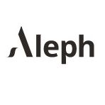

  
  <h1>Empresas Unicornios</h1>

 

La definición de “unicornio” dice que es una criatura mitológica representada por un caballo blanco con un cuerno en su frente. Pero en los últimos años, este término ganó repercusión en el mundo de los negocios, de la mano de las llamadas empresas unicornio. Esta reciente denominación se le otorga a una empresa nueva -en etapa de crecimiento- . que supera una determinada valuación. Casualmente, son las compañías que con mayor fuerza vienen irrumpiendo en el mercado. En este escenario, Argentina ha sido uno de los países que más ha dado que hablar en los últimos años, esto gracias al surgimiento de Start Ups que realmente están haciendo las cosas bien. Dicho esto, vamos a conocer cuáles son las empresas unicornio en Argentina y Latinoamérica. Además, analizaremos qué características tienen y cómo se viene dando su crecimiento.

 

  
  <h2>¿Qué es una empresa unicornio?</h2>
  
Las empresas unicornio son aquellas compañías que alcanzan un valor de mercado de 1.000 millones de dólares durante sus primeros años de lanzamiento. Además, no tienen que haber ingresado aún a la bolsa de valores.

Algunas incluso logran esa cotización sin contar con el financiamiento de inversionistas u otras empresas más grandes. En su mayoría, las empresas unicornio corresponden a startups, es decir, compañías que proveen algún servicio tecnológico innovador.

La mayoría de estas compañías no llegan a cumplir los 10 años de antigüedad. Sin embargo, su crecimiento escaló tanto que ya consiguieron ganancias que superan la barrera de los 1.000 millones de dólares.

La mayor cantidad de empresas unicornio tiene su origen en Estados Unidos, aunque las más importantes provienen de China. La mayor es la compañía Ant Financial, con una valoración de 150 mil millones de dólares. Luego le siguen Alibaba, también de origen chino, y Uber, de los Estados Unidos.

El término fue acuñado por primera vez en 2013 por Aileen Lee, la fundadora de Cowboy Ventures. Ella definió a las empresas unicornio como: “una compañía tecnológica que alcanza el valor de 1.000 millones de dólares en algún momento de su proceso de levantamiento de capital, sin llegar a cotizar en bolsa”.

  

  
  <h2>Otras características que comparten las empresas unicornio son las siguientes:</h2>

  - Tienen un valor de más de 1.000 millones de dólares: Su alta cotización debe basarse en el capital privado, sin formar parte de la bolsa de valores. Una vez que estas empresas cotizan en bolsa, dejan de ser consideradas como unicornios.

- Son aliadas de las nuevas tecnologías: Son empresas que se adaptan al entorno digital para generar un nuevo mercado dominante. Su aliado principal suelen ser las redes sociales.

- Son innovadoras y disruptivas: Se trata de compañías que crean nuevas tendencias en el mercado, en gran medida gracias a la aplicación tecnológica.

- Son compañías jóvenes: En su gran mayoría, las empresas unicornio tienen menos de 10 años de operación. Incluso sus dueños y fundadores tienen una edad promedio de 34 años.

- Son empresas B2B: Los unicornios se ocupan de desarrollar una eficaz estrategia comercial para llegar a su consumidor final. Para eso manejan excelentes campañas de marketing.

- Son exponenciales y escalables: Estas empresas crecen de forma acelerada. Además, su modelo de negocios es escalable a largo plazo, a pesar de contar con una baja inversión al comienzo.
- Aprovechan la economía colaborativa: Son compañías que utilizan bienes que no son completamente aprovechados en el mercado. La meta que persiguen es intercambiarlos a cambio de una compensación económica.
  

  

<!DOCTYPE html>
<html>
<head>
</head>
<body>
    <h1>Distribución de Empresas Unicornio</h1>
    
¿Donde se encuentran la mayoría de estas empresas?

    
En los Estados Unidos están la gran mayoría de empresas unicornios, acaparando casi la mitad de la lista con un 40%. Seguidamente encontramos a China con un 26%, y después, con mucha menos representación esta Reino Unido con un 5%, India 4%, Alemania y Corea del Sur ambas con un 2%. Luego existen algunos países con menos de 2% que también cuenta con este tipo de empresas pero que recién se están sumando como España, que aun no se establecen.

    
</body>
</html>

  <h2>¿Cuáles son las empresas unicornio en Argentina?</h2>
  La Argentina tiene, actualmente, 11 empresas consideradas unicornio, en su mayoría startups, y hay una compañía candidata a convertirse en la número 12. La tradición de empresas unicornio en Argentina fue iniciada hace más de diez años por Mercado Libre, Despegar, Globant y OLX. Estas colocaron la piedra angular y continúan como referentes de emprendedores y empresas de base tecnológica que recién comienzan.

Al primer pelotón de unicornios se sumaron luego Auth0, Vercel, Aleph y Mural. Por último, Bitfarms, Ualá y TiendaNube pasaron a integrar este selecto club en agosto del 2021.
<ul>
    <li>
      Mercado Libre    
      

        Nació en Argentina en 1999 y se convirtió en la plataforma de comercio electrónico más popular de todo Latinoamérica. La empresa fundada por Marcos Galperín superó en 2015 los 138 millones de usuarios registrados en América Latina.

También rompió la barrera de los 34 millones de productos vendidos y reportó transacciones por USD 1.842 millones. Hoy tiene un valor aproximado de 95.000 millones de dólares.
 

    </li>
    <li>
      Despegar    
      

        Nació en Argentina en 1999 y se convirtió en la plataforma de comercio electrónico más popular de todo Latinoamérica. La empresa fundada por Marcos Galperín superó en 2015 los 138 millones de usuarios registrados en América Latina.

También rompió la barrera de los 34 millones de productos vendidos y reportó transacciones por USD 1.842 millones. Hoy tiene un valor aproximado de 95.000 millones de dólares.
Esta compañia de turismo comenzó en 1999 como una agencia de viajes B2C (negocio a consumidor final). Para el año 2017 superaba los USD  2.000 millones. Sin embargo, la crisis por la pandemia del COVID hizo que durante el 2020 su capitalización bursátil cayera a la mitad. En la actualidad, su valor en la bolsa ronda los USD 800 millones.

   

    </li>
    <li>
      Globant     
      

        Se trata de una compañía de ingeniería de software y tecnología de la información fundada en el año 2003.  La pandemia disparó la facturación de la empresa, así como su presencia global, debido a la necesidad de adaptar soluciones tecnológicas en todo el mundo.

Para darte una idea de su crecimiento, podemos darte los siguientes datos. Tan solo durante 2020, Globant aumentó su facturación anual en un 23,5%. La empresa trasladó su sede a Luxemburgo y hoy presenta un valor de 13.500 millones de dólares.

  

    </li>
    <li>
      OLX     
      

        Fue fundada en 2006 por el empresario Alec Oxenford, también creador de DeRemate. OLX es una plataforma de clasificados online que tiene más de 200 millones de usuarios.

Su fuerte es, sin dudas, la compra y venta de autos usados en Argentina. Este unicornio nacional no cotiza en la bolsa, pero tiene un valor que supera los USD 1.000 millones.

  

    </li>
    <li>
      Auth0     
      

        Se trata de una empresa enfocada en la ciberseguridad y autenticación. Fundada en 2013, alcanzó rápidamente el éxito. Prueba de ello es que recientemente fue adquirida por la empresa de gestión de identidades Okta, por un valor de USD 6.500 millones.
      

    </li>

   <li>
      TiendaNube     
      

        Esta empresa unicornio de Argentina se dedica al E-commerce, ofreciendo una plataforma completa y sencilla de usar para que los comerciantes puedan ofrecer sus productos. La característica de la misma, es que cada usuario pueda personalizar su sitio, ofreciendo un punto que no era común hasta el momento.

La misma fue fundada hace relativamente poco, en 2015, por Santiago Sosa, Alejandro Vásquez y Martín Polombo. Gracias a un fondeo recibido el año pasado, TiendaNube llegó a pasar los 3.000 millones de dólares de valor.
      

    </li>

  <li>
      Ualá     
      

        Esta empresa nacida en 2017 es una Fintech, es decir, una banca o una billetera virtual. La misma comenzó con una tarjeta de débito recargable que puede ser usada internacionalmente; para luego ir expandiéndose en distintas soluciones financieras. 

Ualá fue fundada por el joven Pierpaolo Barbieri. CEO que se ha convertido en “influencer” financiero, dándole a la empresa un perfil joven y moderno. Luego de varios financiamientos internacionales, Ualá ha llegado a los 2.450 mdd de valor.
      

  </li>
  <li>
      Aleph    
      

        Aleph es un caso particular en el ámbito de las empresas unicornio argentinas. Debido a que la misma se encarga de servicios de publicidad y marketing. Lo que la une a las demás unicornio es que Aleph trabaja con fuertes algoritmos de inteligencia artificial. Inteligencia que se utiliza para dirigir publicidad con extrema precisión.

Esta firma fue fundada por Gastón Taratuta en el año 2005. Un dato no menor, revelado por Forbes Argentina en este artículo, es que Mercado Libre invirtió 25 millones de dólares en ellos. Dando un voto de confianza para que gran cantidad de inversores se acerquen.  
      

  </li>
  <li>
      Mural     
      

        Mural es una empresa unicornio argentina que se dedica a brindar soluciones y herramientas para generar equipos y mejorar el trabajo creativo de manera remota. 

La misma fue fundada en 2011 por Patricio Jutard, Mariano Batard y Agustín Soler.

En tiempos de teletrabajo y cuarentena, Mural aumentó sus clientes y productividad en porcentajes grandísimos, empujadas por clientes de alto calibre como IBM, Autodesk, GiftHub y Atlassian.
      

  </li>
  <li>
      Vercel     
      

        Vercel es una empresa de tecnología y desarrollo, orientada al diseño web. Este unicornio argentino ofrece una plataforma con un marco de código abierto para desarrolladores. Cuentan con plantillas interactivas y dinámicas, y generan grandes ventajas para los programadores front-end.

Esta empresa fundada por Guillermo Rauch en 2015, la misma tiene clientes top en el mundo como Facebook, Mc Donald’s, Uber, TikTok, Nike y Adidas.
      

  </li>
  <li>
       Technisys     
      

        Esta empresa es una fintech y banca digital. Negocio que fue fundado por Mike Santos, Adrián Iglesias y Germán Pugliese Baressi en el año 1995, sentando precedentes, demostrándose como unos adelantados en el ámbito. 

Esta empresa unicornio fue vendida en el año 2020 a SoFi Technologies, por 1.100 mdd. Actualmente, sus dueños trabajan también como inversores ángeles de Start Ups argentinas.
      

  </li>
  <li>
      Bitfarms    
      

        La última en esta lista de empresas unicornio argentinas, es la más nueva. Fundada por Emilio Grodzki y Nicolás Bonta en 2017, Bitfarms es una empresa dedicada al minado de criptomonedas. La misma cotiza en las bolsas de Toronto y de New York, y llegó a ser unicornio en el año 2021.
      

  </li>
  </ul>
  

  
  <h2>Conclusión</h2>

  Las empresas unicornio son aquellas compañías en plena etapa de crecimiento, cuya cotización ya ha superado los 1.000 millones de dólares. Además, no deben cotizar en la bolsa, pues una vez que lo hacen pierden su status de unicornios.

Actualmente, son las startups quienes dominan esta categoría empresarial. Las startups argentinas atraviesan su mejor momento, por lo que 11 compañías nacionales ya integran este selecto club. Cabe destacar el importante aporte de estas empresas en la creación de riqueza, empleo e innovación para nuestro país.

  
  <h2>Referencias Bibliográficas</h2>

  <ul>
    <li> Espacio Empresa:
  https://espacioempresa.com/noticias/empresas-unicornio-argentinas/
       </li> 
    
  <li>
      Eldestape: https://www.eldestapeweb.com/sociedad/-argentina/cuales-son-las-empresas-unicornio-de-argentina--202261223580?utm_medium=paid&utm_source=Google&utm_campaign=DSA_Dinamico6&gad=1&gclid=CjwKCAjw3oqoBhAjEiwA_UaLtsmleJeew73ZjHS45wRnpmbBvYfgfwnXXcs4Pmjie-Zuzd052vLT3hoCfYYQAvD_BwE
    </li>    
    <li>
    BAE NEGOCIOS:
  https://www.baenegocios.com/negocios/Empresas-unicornio-cuales-son-las-11-firmas-argentinas-que-revolucionan-el-mercado-internacional-20220126-0121.html
          </li>
  </ul>

